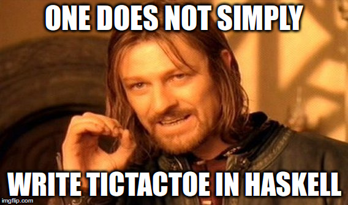

Goal:
* have a working tick tack toe game by the end of the class


Running the game:
```bash
runhaskell Game.hs
```
or
```bash
ghc --make Game.hs
./Game
```

TODO - your job:
* implement functions in TicTacToe.hs:
    * winner
    * doMove
    * printBoard
* (maybe) edit the gameLoop inside Game.hs
* check that tests are passing

GHCI cheat-scheat:
* `ghci FileName.hs` eg. `ghci TicTacToe.hs` or `ghci` followed by `:l TicTacToe`
* `:l ModuleName` - load the module (similar to import ModuleName)
* `:t someVariable` - check the type
* `:print variableName`

Running tests:
```bash
runhaskell TestTicTacToe.hs
```

Suggested tutorial:
http://learnyouahaskell.com/chapters

Debugging:
```bash
ghci Game.hs
#GHCi, version 7.10.3: http://www.haskell.org/ghc/  :? for help
#[1 of 2] Compiling TicTacToe        ( TicTacToe.hs, interpreted )
#[2 of 2] Compiling Main             ( Game.hs, interpreted )
#Ok, modules loaded: TicTacToe, Main.
#*Main>
:break Main 54 #change the number
# Breakpoint 0 activated at Game.hs:54:3-10
# add moar breakpoins ...
main # run the program like a champ
#....
#Stopped at Game.hs:54:3-10
#_result :: IO () = _
#[Game.hs:54:3-10] *Main>


#Useful commands:
#- :help -everything under the '-- Commands for debugging:' section:
#- :continue
#- :step
#- :steplocal
#- :break
```